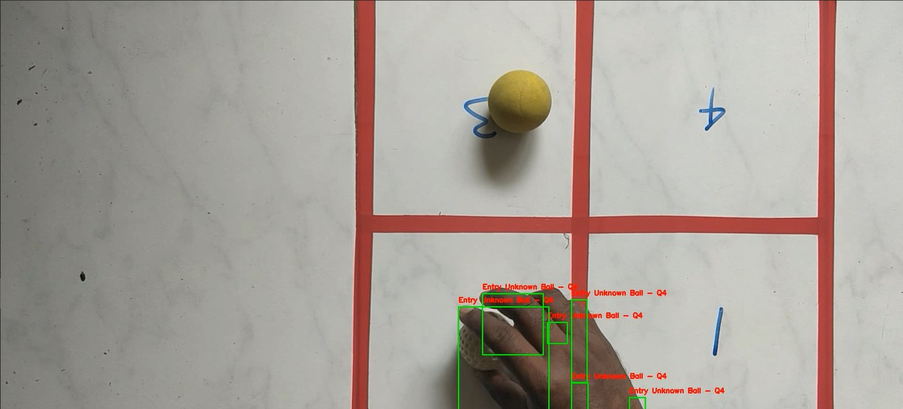

# Ball Tracking and Event Recording in Video



This project involves tracking balls of different colors (Blue, Green, and Red) in a video, recording their entry events into different quadrants, and generating an output video with annotated events and a text file with event records.

## Project Overview

The main objectives of this project are:
1. Download the input video (if not already available).
2. Process the video to detect and track balls of different colors.
3. Determine the quadrant of entry for each detected ball.
4. Generate an output video with annotations for ball entries.
5. Create a text file recording the events with timestamps, quadrant numbers, ball colors, and event types.

Due to the large size of the input video, it could not be included in this repository. Please ensure you have the correct input video file named `input_video.mp4` in your working directory before running the code.

## Requirements

Make sure you have the following libraries installed:
- OpenCV
- NumPy
- Pandas
- gdown (for downloading the video, if needed)

You can install these libraries using pip:
```bash
pip install opencv-python numpy pandas gdown
